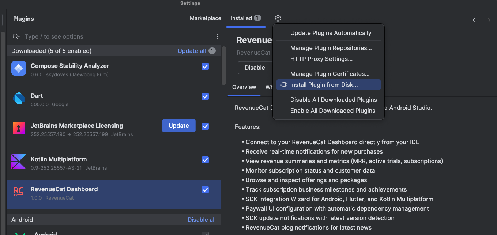
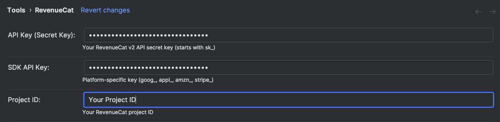
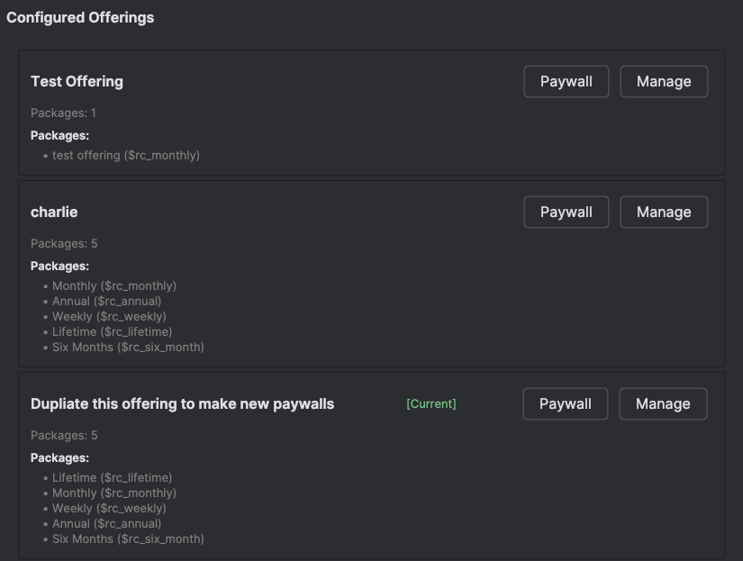
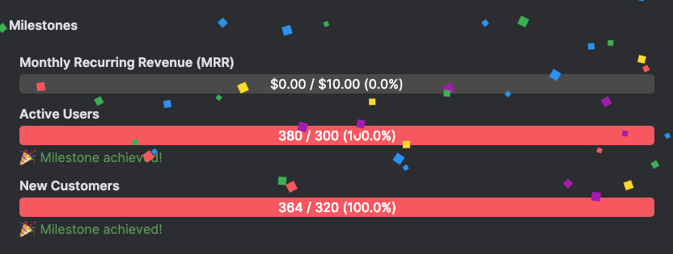
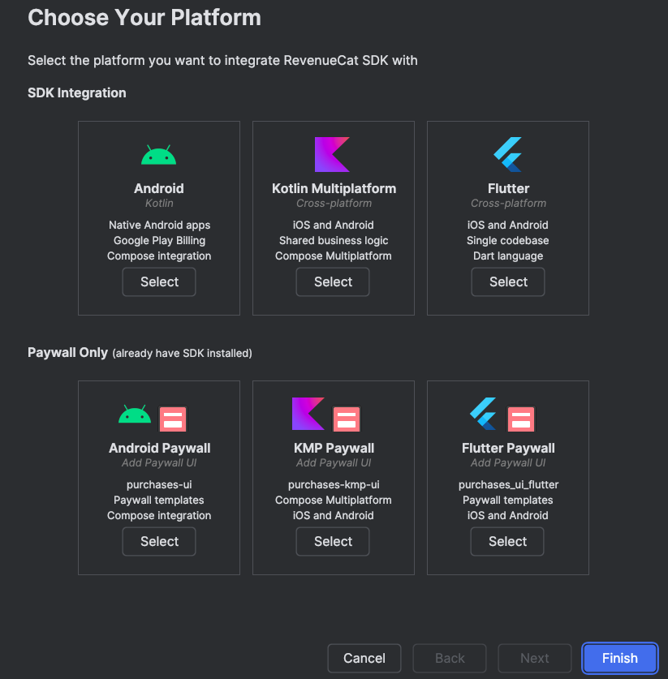
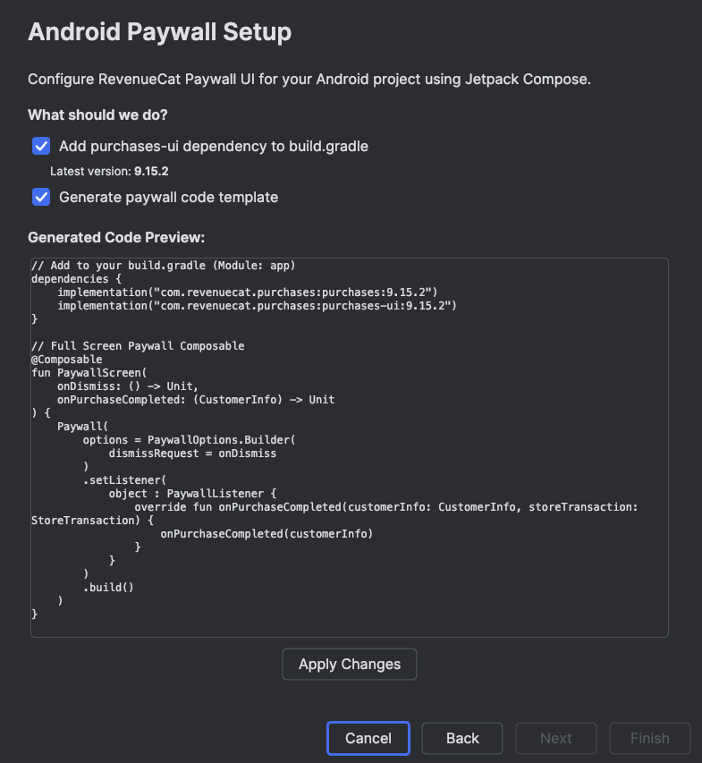
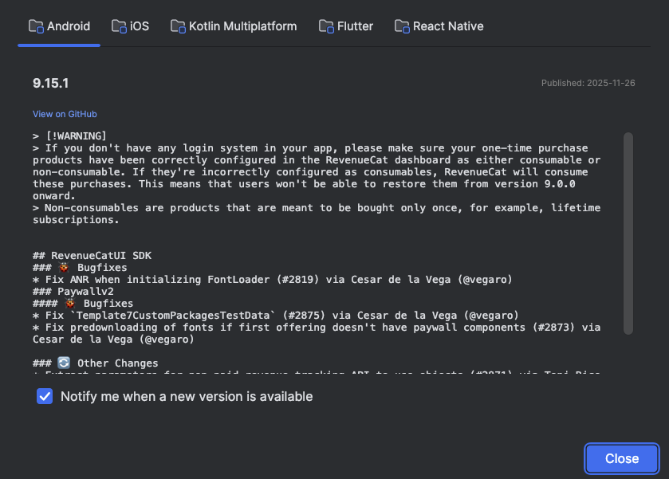
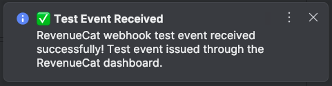

<h1 align="center">RevenueCat IntelliJ Plugin</h1></br>

<p align="center">
  <a href="https://opensource.org/licenses/Apache-2.0"></a>
  <a href="https://plugins.jetbrains.com/plugin/29265-revenuecat-dashboard"></a>
</p>

The RevenueCat IntelliJ Plugin brings **subscription metrics analysis** and **SDK integration** directly into your IDE (Android Studio or any IntelliJ IDE), helping you monitor your app's subscription performance and set up RevenueCat SDK without leaving your development environment.

This plugin provides insights about your RevenueCat project through an integrated tool window with multiple features:

- **Metrics Dashboard**: View key subscription metrics like MRR, active trials, active subscriptions, and revenue.
- **Real-time Purchase Notifications**: Receive instant notifications for new purchases as they happen.
- **Offerings Management**: Browse and inspect your configured offerings and packages directly from the IDE.
- **Milestones Tracking**: Track your subscription business milestones and achievements.
- **SDK Integration Wizard**: Set up RevenueCat SDK for Android, Flutter, or Kotlin Multiplatform projects with guided configuration.
- **Paywall Configuration**: Generate paywall UI code templates for your platform with automatic dependency management.

> **Note**: This plugin requires a RevenueCat account and API credentials. You'll need your API Secret Key from the [RevenueCat dashboard](https://app.revenuecat.com/) to authenticate and access your project data.

## How to Install in Android Studio or IntelliJ IDE

You can download the RevenueCat Plugin with the steps below:

0. Download the plugin file below:
1. Open IntelliJ IDEA
2. Go to **Settings/Preferences** (⌘, on Mac or Ctrl+Alt+S on Windows/Linux)
3. Navigate to **Plugins**
4. Click the gear icon ⚙️ → **Install Plugin from Disk...**
5. Select the `revenuecat-plugin-1.0.0.zip` file from the `build/distributions/` folder
6. Restart IntelliJ IDEA when prompted

> Note: For now, it's under the review process on the JetBrains MarketPlace. Once it's ready, you can directly download from the marketplace.



If you see the RevenueCat tool window icon on the right side of your IDE, you're all set! If you don’t see it there, you can enable it via View → Tool Windows → RevenueCat.

> **Note**: The plugin is compatible with IntelliJ IDEA 2023.1 and later versions, including Android Studio Hedgehog and newer.

### Initial Configuration

After installing the plugin, you need to configure your RevenueCat API credentials:



1. Click the **Settings** icon in the RevenueCat tool window toolbar.
2. Enter your **API Secret Key** from the RevenueCat dashboard.
3. Enter your **Project ID** (found in your RevenueCat project settings).
4. Click **Apply** to save your configuration.

Once configured, the plugin will automatically fetch and display your subscription metrics!

## Metrics Dashboard

The Metrics Dashboard provides visibility into your subscription business performance directly within your IDE:


The dashboard displays key metrics including:

- **Monthly Recurring Revenue (MRR)**: Your current monthly recurring revenue.
- **Active Trials**: Number of users currently in a trial period.
- **Active Subscriptions**: Total number of active paid subscriptions.
- **Revenue**: Total revenue generated.

## Offerings Management

Browse your RevenueCat offerings configuration without switching to the web dashboard:



The Offerings tab displays:

- All configured offerings in your project
- Packages within each offering
- Product details including identifiers and pricing

This helps you verify your offerings configuration while developing purchase flows in your app.

## Milestones Tracking

Track your subscription business milestones and celebrate your achievements:



The Milestones tab shows:

- Completed milestones with achievement dates
- Upcoming milestone targets
- Progress towards your next goal

Stay motivated by seeing your subscription business growth directly in your IDE!

## SDK Integration Wizard

The SDK Integration Wizard guides you through setting up RevenueCat SDK in your project:



### Supported Platforms

The wizard supports three platforms:

| Platform | SDK | Dependency Management |
|----------|-----|----------------------|
| Android | purchases-android | Gradle (TOML or direct) |
| Flutter | purchases_flutter | pubspec.yaml |
| Kotlin Multiplatform | purchases-kmp | Gradle (TOML or direct) |

## Paywall Configuration

After setting up the SDK, you can configure Paywall UI for your project:



### Supported Paywall SDKs

| Platform | Paywall SDK |
|----------|-------------|
| Android | purchases-ui |
| Flutter | purchases_ui_flutter |
| Kotlin Multiplatform | purchases-kmp-ui |

## SDK Release Notes and Notifications

Stay up-to-date with the latest RevenueCat SDK releases without leaving your IDE:



The plugin automatically monitors RevenueCat SDK releases and notifies you when new versions are available:

- **SDK Update Notifications**: Get notified when new versions of RevenueCat SDKs are released for Android, iOS, React Native Flutter, or KMP.
- **Release Notes Dialog**: View detailed release notes directly in the IDE with a formatted changelog.
- **Quick Navigation**: One-click access to GitHub releases for full release details.

This helps you keep your RevenueCat integration current and take advantage of new features and bug fixes as soon as they're available.

## Webhook and Notifications

The plugin provides two methods for receiving purchase notifications:



### Real-time Webhook Notifications (Recommended)

For instant, real-time notifications, the plugin includes a built-in webhook server:

1. Go to **Settings** → **RevenueCat Settings**
2. Enable **"Enable real-time webhook notifications"**
3. Configure the **Webhook Port** (default: 48889)
4. Click **"Start Webhook Server"** to start the local server
5. Use **ngrok** to expose your local webhook to the internet for testing with RevenueCat's webhook integration

The webhook server handles RevenueCat webhook events and displays desktop notifications for:
- **Initial Purchases**: New subscription or one-time purchase events
- **Renewals**: Subscription renewal notifications
- **Cancellations**: When a user cancels their subscription
- **Billing Issues**: Failed payment or billing problem alerts
- **Expirations**: Subscription expiration notifications

## Find this plugin useful?

Support it by joining __[stargazers](https://github.com/revenuecat/intellij-plugin/stargazers)__ for this repository ⭐️. <br>

# License

```xml
Copyright (c) 2025 RevenueCat, Inc.

Licensed under the Apache License, Version 2.0 (the "License");
you may not use this file except in compliance with the License.
You may obtain a copy of the License at

   http://www.apache.org/licenses/LICENSE-2.0

Unless required by applicable law or agreed to in writing, software
distributed under the License is distributed on an "AS IS" BASIS,
WITHOUT WARRANTIES OR CONDITIONS OF ANY KIND, either express or implied.
See the License for the specific language governing permissions and
limitations under the License.
```
